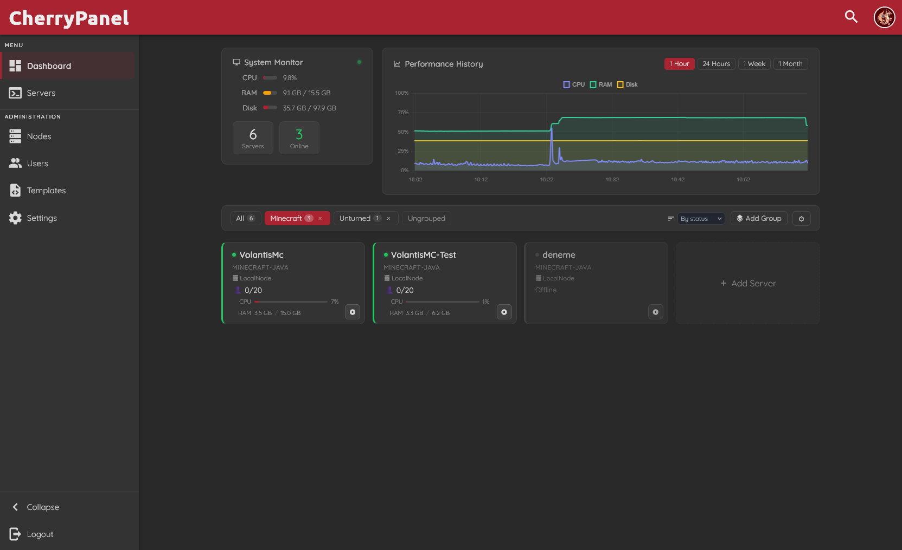
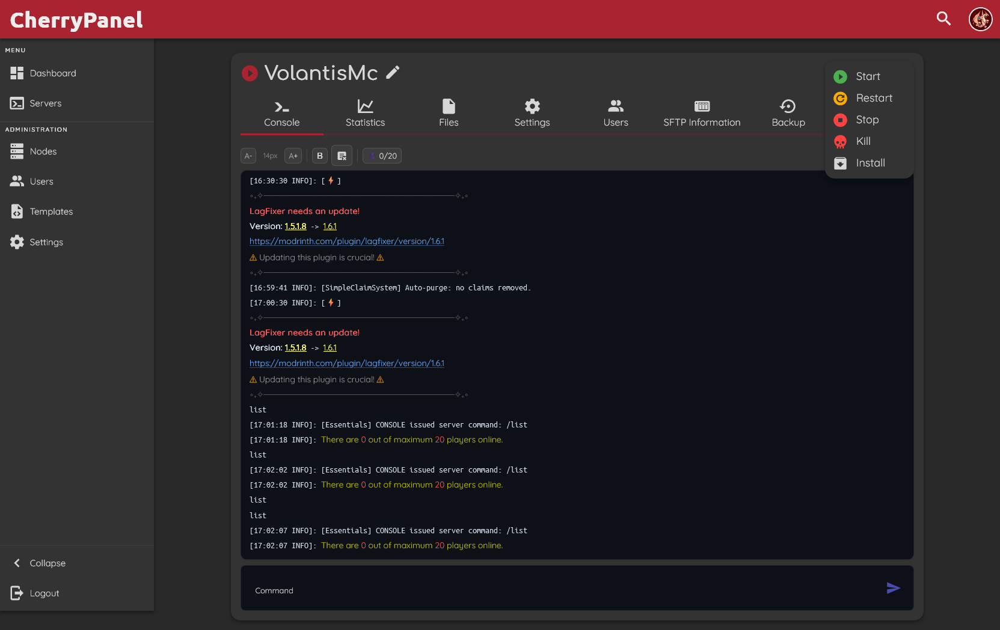
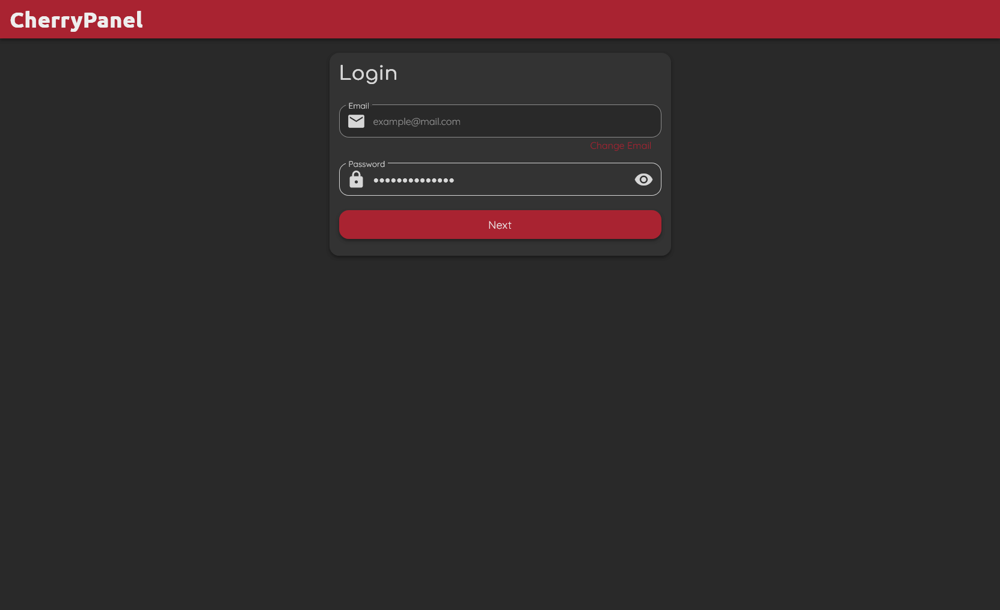

<div align="center">
  
  <h1>CherryPanel</h1>
  <p>
    Open-source game server management panel — fork of <a href="https://github.com/pufferpanel/pufferpanel">PufferPanel</a> with real-time player tracking, multi-game support, Turkish language, and a polished dashboard.
  </p>
  <p>
    <em>Arkadaşlarınızla oyun oynamak için kendi sunucu yönetim panelinizi kurun. Ücretsiz, açık kaynak.</em>
  </p>

  
  
  
  
</div>

---

## Screenshots

<table>
  <tr>
    <td align="center"><b>Dashboard</b></td>
    <td align="center"><b>Server Console</b></td>
    <td align="center"><b>Login</b></td>
  </tr>
  <tr>
    <td></td>
    <td></td>
    <td></td>
  </tr>
</table>

---

## What is CherryPanel?

**CherryPanel** is a free, self-hosted game server management panel based on [PufferPanel](https://pufferpanel.com). It lets you run and manage game servers (Minecraft, Unturned, Terraria, Valheim, and more) from a single web interface — no command-line knowledge required for day-to-day use.

**Perfect for:**
- Running a **Minecraft server with friends** on your own VPS or dedicated machine
- Managing multiple game servers from one panel
- Server admins who want a clean, modern dashboard with real-time stats

It uses the same **Go backend** as PufferPanel (API, daemon, database unchanged) and adds a significantly improved **Vue 3 frontend**.

> **CherryPanel is a derivative work.** Original PufferPanel codebase © 2025 PufferPanel (Apache 2.0). Modifications © 2026 Alperen (vlamz).

---

## Quick Install (no build tools needed)

Download the pre-built zip from the [latest release](https://github.com/vlamz/CherryPanel/releases/latest) and extract it to your PufferPanel webroot:

```bash
# Download the latest release
wget https://github.com/vlamz/CherryPanel/releases/latest/download/cherry-frontend.zip

# Extract to a temporary folder
unzip cherry-frontend.zip -d /tmp/cherry

# Copy to your PufferPanel webroot (adjust path if needed)
sudo cp -r /tmp/cherry/* /var/www/pufferpanel/

# Hard-refresh your browser
# Ctrl+Shift+R
```

> **Requires a working [PufferPanel v3](https://docs.pufferpanel.com) installation.**
> The Go backend (API, daemon, database) is **never touched** — only the frontend files are replaced.

---

## Features

### 🎮 Real-Time Player Count — Multi-Game
Live player count on every server card in the Dashboard. Updates **instantly** when a player joins or leaves (WebSocket-based, no polling).

| Server Type | Games |
|---|---|
| `minecraft` / `minecraft-java` | Minecraft Java, Paper, Purpur, Spigot, Essentials |
| `srcds` | Unturned, CS:GO, TF2, Garry's Mod, Rust, ARK, 7 Days to Die, Squad, Don't Starve Together |
| `terraria` | Terraria (TShock / Vanilla / tModLoader) |
| `factorio` | Factorio |
| `valheim` | Valheim |
| `zomboid` | Project Zomboid |
| `eco` | Eco |
| `custom` | Vintage Story |
| Generic | Any game with "player joined/connected" style logs |

Shows **current/max** format (e.g. `0/24`) — max is read from server definition or from the game's response to the `list` command.

### 🦵 Game-Aware Kick / Ban
Player list popup with **Kick** and **Ban** buttons per player. Commands are adapted per game type — buttons are hidden when the game doesn't support them.

### ▶ Dashboard Start / Stop
Each server card has a **▶ Start** button (when offline) or **■ Stop** button (when online). Clicking them does not navigate away from the dashboard.

### 🔒 Anti-Spoof Player Detection (Minecraft)
Join/leave/list parsing is anchored to the server's INFO log prefix. A player **cannot spoof** these events by typing fake log lines in chat.

### 📊 Enhanced Dashboard
- CPU usage normalized to total system capacity (multi-core aware)
- RAM usage with per-server memory limit from server definition
- Performance history chart (1h / 24h / 1w / 1mo selectable range)
- Server grouping and sorting (by status / name / player count / node)
- Adjustable refresh interval (5s – 60s)

### 🎨 Theme Presets

| Preset | Description |
|---|---|
| **Classic** | Dark mode with cherry red accent — default |
| **Light** | Light mode with cherry red accent |
| **Dark Modern** | Deep navy dark mode with rounded corners |

Accent color is fully customizable via Preferences → Theme → Base Color.

---

## 🇹🇷 Türkçe Dil Desteği

CherryPanel, PufferPanel'in resmi Türkçe çevirilerine ek olarak kendi özel bileşenleri için de tam Türkçe dil desteği sunar.

**Türkçe olan bileşenler:**
- Dashboard — tüm arayüz metinleri
- Oyuncu listesi paneli (Online Oyuncular, Yükleniyor…, Şu an kimse yok)
- Kick / Ban buton etiketleri
- Tema ayarları ve tüm tercihler sayfası

**Dili değiştirmek için:**
Sağ üst köşedeki profil ikonuna tıkla → **Preferences** → **Language** → **Türkçe** seç → **Save Preferences**.

> Yanlış veya eksik çeviri bulursanız `client/frontend/src/lang/tr_TR/` klasöründeki JSON dosyalarını düzenleyip pull request açabilirsiniz.

---

## Installation (from source)

### Prerequisites
- A working [PufferPanel v3](https://docs.pufferpanel.com) installation
- Node.js 22+ and yarn

### Build and install

```bash
git clone https://github.com/vlamz/CherryPanel.git
cd CherryPanel/client
yarn install
yarn build
# Output is in: client/frontend/dist/

sudo cp -r frontend/dist/index.html frontend/dist/js/ frontend/dist/css/ \
           frontend/dist/favicon.png frontend/dist/favicon.ico \
           /var/www/pufferpanel/
```

---

## Configuration

### CPU normalization
CherryPanel shows CPU usage as a percentage of total system capacity. Default assumes **12 logical CPUs** (6 cores × 2 threads).

To adjust: Dashboard → **⚙ gear icon** (top right) → set your CPU count.

```bash
# Find your CPU count
lscpu | grep "^CPU(s):"
```

### Accent color
Default is cherry red (`#A92331`). Change per-user in **Preferences → Theme → Base Color**.

### Panel name
The panel title comes from the PufferPanel backend. Change it in **Settings → Branding**.

---

## Compatibility

| Component | Version |
|---|---|
| PufferPanel backend | v3.x |
| Node.js (build only) | 22+ |
| Browsers | All modern browsers (Chrome, Firefox, Safari, Edge) |
| OS (server) | Linux (amd64 / arm64) |
| Minecraft plugin support | Vanilla, Essentials, EssentialsX, CMI, Paper, Purpur, Spigot |

---

## Project Structure (changed files)

```
client/frontend/src/
├── views/
│   ├── Dashboard.vue              # Player counts, start/stop, charts, groups, settings
│   └── self/Preferences.vue      # Theme presets (Classic, Light, Dark Modern)
├── components/server/
│   └── PlayerCount.vue            # Per-server player list with game-aware kick/ban
├── utils/
│   └── consolePlayerParser.js     # Multi-game parser, anti-spoof anchoring, §X stripping
├── lang/
│   ├── en_US/servers.json         # English: PlayersOnline, Kick, Ban, …
│   └── tr_TR/servers.json         # Turkish: Online Oyuncular, Kick, Ban, …
└── themes/default/
    └── manifest.json              # Default mode: dark, color: #A92331
screenshots/
├── dashboard.png                  # Dashboard with player counts and performance chart
├── console.png                    # Server console with player count widget and action buttons
└── login.png                      # Login page
```

---

## Releases

Pre-built frontend zips are published automatically on every `cherry-v*` tag via GitHub Actions.

[→ See all releases](https://github.com/vlamz/CherryPanel/releases)

---

## Contributing

Pull requests are welcome. Open an issue first for major changes.

- Match the code style of the file you're editing
- Translation fixes: edit `client/frontend/src/lang/{locale}/` JSON files
- New game support: add patterns to `consolePlayerParser.js`

---

## Credits

- **[PufferPanel](https://github.com/pufferpanel/pufferpanel)** — original open-source game server panel (Apache 2.0)
- **[vlamz](https://github.com/vlamz)** — CherryPanel modifications and additions

---

## License

Apache License 2.0 — same as PufferPanel.

```
Copyright 2026 Alperen (vlamz) — CherryPanel modifications
Copyright 2025 PufferPanel — original work
```

---

<div align="center">
  <sub>
    Keywords: game server panel · minecraft server management · self-hosted game server · pufferpanel fork ·
    minecraft sunucu kurma · oyun sunucusu yönetim paneli · türkçe oyun paneli · arkadaşlarla minecraft ·
    unturned server panel · open source server management
  </sub>
</div>
